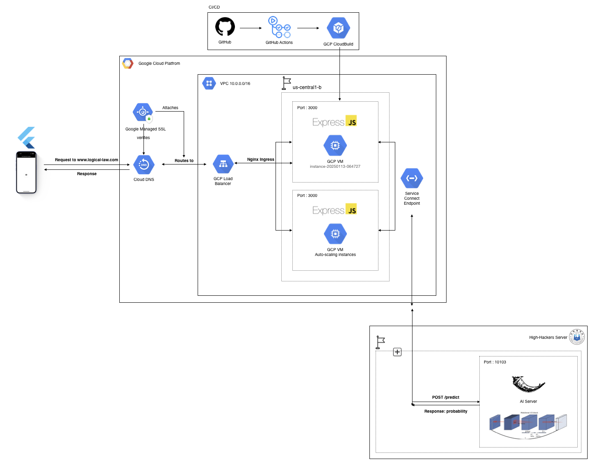

# ☘️ (2025) GreenTech Globalton NodeJS
**Team 3: High-Hackers**

Our system seamlessly integrates Flutter for the front-end with Express.js, Flask, and Google Cloud Platform (GCP) for the back-end.

By leveraging our AI models, our hardware can instantly detect forest fires, enabling managers to monitor and assess affected areas in real time through our app.

**Key Features**
   1.	**Real-Time Monitoring**
Administrators can interact with a central map in the app to view management areas and select devices for real-time wildfire monitoring and risk analysis.

   2.	**Future Expansion**
We aim to enhance our system with an integrated AI monitoring network, utilizing drones and satellites for precise wildfire detection and climate change adaptation strategies.

## 👥 My Team Contributors

| Name              | Roles                 |
|-------------------|-----------------------|
| Nilufar Kurbonova | Team Leader, Planning | 
| Nozima            | Researching           |
| Lim Sun-Jong      | AI                    |
| Kim JunHo         | Back-end, Front-end   |


## 📺 Demo Video
Experience the functionality of this project by watching the demo video:  
[Watch the Demo](https://youtube.com/shorts/Xlh7Vsu9PM8?feature=share)

## 🚀 Start

### 1. Requirement

This project was carried out in the following environment.

- **Node.js v23.6.0**  
- **npm v10.9.2**  
- **MySQL v8.0**  
- **UTF-8 (includes some Korean content)**  
- **Google Cloud Platform (GCP) account**  

### 2. Install

#### **Copy your local environment**

1. **Clone this repository**
   ```bash
   git clone https://github.com/your-username/greentech_globalthon_nodejs.git
   cd greentech_globalthon_nodejs
2. **Install dependancy**
   ```bash
   npm install
3. **Set environmental variables**
   ```bash
   COOKIE_SECRET = your-cookie-secret
   FLASK_URL = your-flask-server-url
   ```
4. **Run production environment of Node.js server**
   ```bash
   npm run prod
   ```
5. **Monit Node.js with command below**
   ```bash
   npx pm2 monit
   ```
---

## 📡 How to Use API
This project provides a comprehensive API for seamless integration.
For detailed instructions and examples, please refer to the [API Usage Guide](docs/API_USAGE.md).

## 🛠️ CI/CD pipeline

### **GCP Cloud Build & GitHub Actions**
For GCP Cloud Build, you must follow these steps.

1. **Open cloudbuild.yaml**

2. **'your-*' part needs to be modified**
   ```bash
   steps:
   # 1. Install dependancy
   - name: 'gcr.io/cloud-builders/npm'
       args: ['install']

   # 2. Update your repository using 'git pull'
   - name: 'gcr.io/cloud-builders/gcloud'
      args:
         - 'compute'
         - 'ssh'
         - 'your-vm-instance'
         - '--zone'
         - 'your-vm-instance-timezone'
         - '--command'
         - |
           git config --global --add safe.directory /home/your-github-account/greentech_globalthon_nodejs && \
           cd /home/your-github-account/greentech_globalthon_nodejs && git pull

   # 3. Restart your server using pm2
   - name: 'gcr.io/cloud-builders/gcloud'
      args:
         - 'compute'
         - 'ssh'
         - 'your-vm-instance'
         - '--zone'
         - 'your-vm-instance-timezone'
         - '--command'
         - |
           cd /home/your-github-account/greentech_globalthon_nodejs && \
           npx pm2 reload all

   # logsBucket
   logsBucket: 'gs://your-bucket-name' 
   ```

## 🗂️ Project architecture


1. **Client request**  
   - When a user sends a request, it is routed to the Express.js server through the GCP Load Balancer.
2. **GCP Express.js server**  
   - The Express.js server handles CRUD operations by communicating with MySQL Cloud SQL.  
3. **High-Hackers Flask server**  
   - The Flask detecting server utilizes the Mobilenet v3 model to detect precise forest fires in real time.

## ⚙️ Tech Stacks

- **Backend**: Node.js, Express.js, Flask
- **Database**: Cloud SQL (MySQL)  
- **Cloud Provider**: Google Cloud Platform (GCP)  
  - GCP VM Instances (with Auto-scaling)  
  - GCP Cloud DNS
  - GCP Managed SSL
  - GCP Cloud Load Balancer  
  - GCP Cloud Build (for CI/CD)
- **AI Models**: Mobilenet v3
- **Code Formatting**: Clang-format
- **Style Guide**: Google C++ Style Guide (adapted where applicable) 

## 🧑‍💻 How to contribute

1. **Fork this repository**
2. **Create a new branch**
   ```bash
   git checkout -b feature/your-new-feature-name your-remote-name/feature/your-new-feature-name
   ```
3. **Commit your change logs**
   ```bash
   git commit -m "feat: add your-change-logs"
   ```
4. **Push your branch**
   ```bash
   git push your-remote-name feature/your-new-feature-name
   ```
5. **Create a pull request at github**


## 📄 Licesne
This project is licensed under the MIT License. For more details, please refer to the [LICENSE](LICENSE.txt) file.


## 📝 Questions or Support
If you have any questions or need support, feel free to open an issue on GitHub or reach out via the following contact methods:
 - Email: logicallawbio@gmail.com
 - GitHub: logicallaw(Kim Jun-Ho)